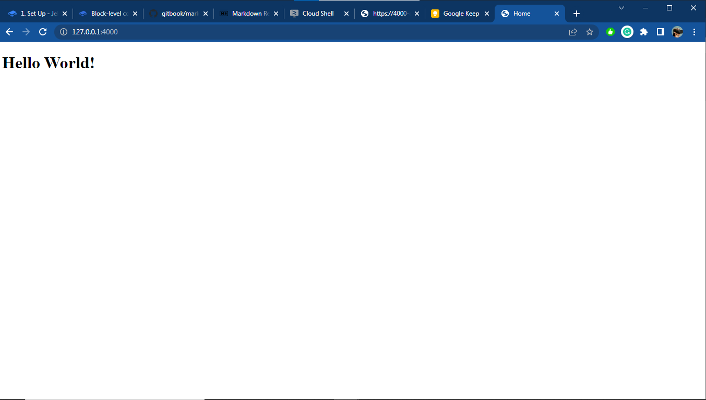

# 1. Set Up

## Introduction

Welcome to Jekyll’s step-by-step tutorial. This tutorial takes you from having some front-end web development experience to building your first Jekyll site from scratch without relying on the default gem-based theme.

## Installation

Jekyll is a Ruby gem. First, install Ruby on your machine. Go to [Installation](https://jekyllrb.com/docs/installation/) and follow the instructions for your operating system.

With Ruby installed, install Jekyll from the terminal:



```shell-session
craigsims@cloudshell:~/$ gem install jekyll bundler
```



```shell
C:\Users\craigsims\dev> gem install jekyll bundler
```



> **Optional:**
>
> Create a folder called <mark style="color:yellow;">`jekyll`</mark> and <mark style="color:yellow;">`cd`</mark> into it
>
> ```shell-session
> craigsims@cloudshell:~/$ mkdir jekyll
> craigsims@cloudshell:~/$ cd jekyll
> craigsims@cloudshell:~/jekyll$ 
> ```

Create a new <mark style="color:yellow;">`Gemfile`</mark> to list your project's dependencies:



```shell-session
craigsims@cloudshell:~/jekyll$ bundle init
```



```bash
C:\Users\craigsims\dev\jekyll> bundle init
```



Edit the <mark style="color:yellow;">`Gemfile`</mark> in a text editor and add jekyll as a dependency.

I'll use <mark style="color:yellow;">`VSCode`</mark> to edit. Follow the steps below:



```shell-session
craigsims@cloudshell:~/jekyll$ code Gemfile
```



```shell
C:\Users\craigsims\dev\jekyll> code Gemfile
```



> <mark style="color:yellow;">`Gemfile`</mark>

```ruby
# frozen_string_literal: true

source "https://rubygems.org"

# gem "rails"
gem "jekyll"
```

Run <mark style="color:yellow;">`bundle`</mark> to install jekyll for your project.



```shell-session
craigsims@cloudshell:~/jekyll$ bundle
```



```shell
C:\Users\craigsims\dev\jekyll> bundle
```



You can now prefix all jekyll commands listed in this tutorial with <mark style="color:yellow;">`bundle exec`</mark> to make sure you use the jekyll version defined in your `Gemfile`.&#x20;

## Create a Site

It's time to create a site! Create a new directory for your site and name it whatever you want. I'll name mine <mark style="color:yellow;">`hello-jekyll`</mark>. Then I'll navigate to it.



```shell-session
craigsims@cloudshell:~/jekyll$ mkdir hello-jekyll && cd hello-jekyll
craigsims@cloudshell:~/jekyll/hello-jekyll$ 
```



```shell
C:\Users\craigsims\dev\jekyll> mkdir hello-jekyll && cd hello-jekyll
C:\Users\craigsims\dev\jekyll\hello-jekyll>
```



Through the rest of this tutorial we'll refer to this directory as **root**.

You can also initialize a Git repository here.



```shell-session
craigsims@cloudshell:~/jekyll/hello-jekyll$ git init
```



```shell
C:\Users\craigsims\dev\jekyll\hello-jekyll> git init
```



One of the great things about Jekyll is there's no database. All content and site structure are files that a Git repository can version. Using a repository is optional but is recommended. You can learn more about using Git by reading the [Git Handbook](https://guides.github.com/introduction/git-handbook/).


Let's add your first file. Create <mark style="color:yellow;">`index.html`</mark> in **root.**



```shell-session
craigsims@cloudshell:~/jekyll/hello-jekyll$ touch index.html && code index.html 
```



```shell
C:\Users\craigsims\dev\jekyll\hello-jekyll> type nul > index.html && code index.html
```



Add the following content to<mark style="color:yellow;">`index.html`</mark>:

> <mark style="color:yellow;">`index.html`</mark>

```html
<!DOCTYPE html>
<html>
  <head>
    <meta charset="utf-8">
    <title>Home</title>
  </head>
  <body>
    <h1>Hello World!</h1>
  </body>
</html>
```

## Build

Since Jekyll is a static site generator, it has to build the site before we can view it. Run either of the following commands to build your site:

* <mark style="color:yellow;">`jekyll build`</mark> - Builds the site and outputs a static site to a directory called `_site`.
* <mark style="color:yellow;">`jekyll serve`</mark> - Does `jekyll build` and runs it on a local web server at `http://localhost:4000`, rebuilding the site any time you make a change.


When you're developing a site, use <mark style="color:yellow;">`jekyll serve`</mark>. To force the browser to refresh with every change, use<mark style="color:yellow;">`jekyll serve --livereload`</mark>. If there's a conflict or you'd like Jekyll to serve your development site at a different URL, use the <mark style="color:yellow;">`--host`</mark> and <mark style="color:yellow;">`--port`</mark> arguments, as described in the [serve command options](https://jekyllrb.com/docs/configuration/options/#serve-command-options)



The version of the site that <mark style="color:yellow;">`jekyll serve`</mark> builds in <mark style="color:yellow;">`_site`</mark> is not suited for deployment. Links and asset URLs in sites created with <mark style="color:yellow;">`jekyll serve`</mark> will use <mark style="color:yellow;">`https://localhost:4000`</mark> or the value set with command-line configuration, instead of the values set in [your site's configuration file](https://jekyllrb.com/docs/configuration/). To learn about how to build your site when it's ready for deployment, read the [Deployment](https://jekyllrb.com/docs/step-by-step/10-deployment/) section of this tutorial.


Run <mark style="color:yellow;">`jekyll serve`</mark> or <mark style="color:yellow;">`bundle exec jekyll serve`</mark> in **root** in the terminal:



```shell-session
craigsims@cloudshell:~/jekyll/hello-jekyll$ jekyll serve
```



```shell
C:\Users\craigsims\dev\jekyll\hello-jekyll> jekyll serve
```



Go to [http://localhost:4000](http://localhost:4000) in your browser. You should see "Hello World!". As seen below:



At this point, you might be thinking, "So what?". The only thing that happened was that Jekyll copied an HTML file from one place to another.

Patience, young grasshopper, there's still much to learn!

Next. you'll learn about Liquid and templating.
